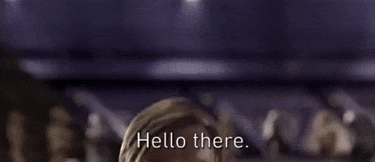

  

 

I'm a Computer Science student, diving headfirst into the world of low-level cybersecurity and software engineering.

My passion lies in understanding how things really work, from the kernel up to the network stack and down to the hardware.

Current Focus
-------------

* **Learning:** Advanced C, x86-64/ARM Assembly, Rust, Go, OS internals (Linux and Windows), GDB, Ghidra, Kernel hacking, and reverse engineering.
* **CTF:** Active in pwn, rev, crypto and some other categories within the team [fr1g1d3r](https://ctftime.org/team/313753).

Interests / Goals
-----------------

- Contributions to open-source security tools or kernel development.
- Vulnerability research and exploit development (for educational purposes, of course).
- Understanding and securing systems.
- Leave a mark in the cybersecurity community.

  <table>
    <tr>
      <td valign="top">
		
      </td>
      <td valign="top">
		
      </td>
    </tr>
  </table>

